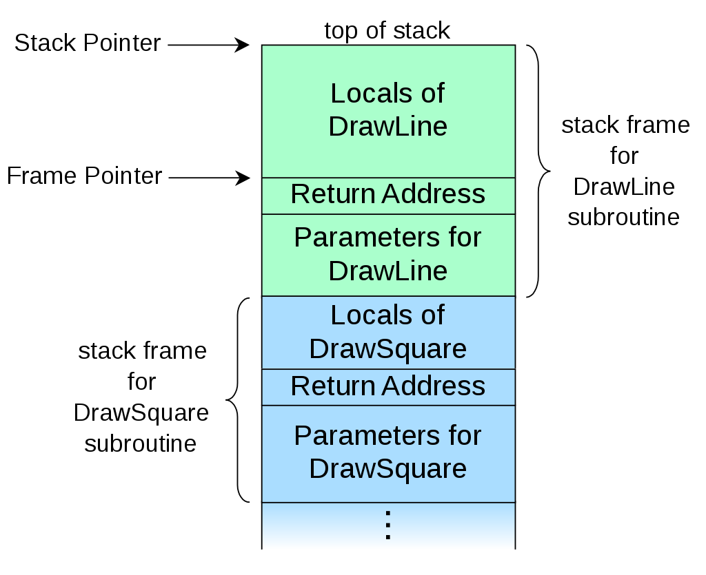

###### lina RADI 

# ASE_TP01_Groupe3 
###   Retour à un contexte

## Compilation
Lancer la commande ```make``` compilera un exécutable "display_stack"et "try_mul".

## Exécution
Lancer la commande ```make displayStack```

Lancer la commande ```make tryMul```

##### Explication pour display_stack
Le sommet de la pile d’exécution est pointé par le registre %esp (stack pointer). 
La base de la pile est pointé par le registre le registre %ebp (base pointer).

- Que ce soit un appel imbriqué ou successif, dans chaque appel à une fonction une nouvelle pile d'execution est cree, et on voit que le esp et ebp changent de valeurs ,en effet les deux registres changent pour pointer vers le debut et respectivement la fin de lanouvelle frame en cours d'exécution.

- Les variables locales et les paramètres appartiennet à la plage d'adresse comprise entre ebp et esp de la fonction courante car elles sont propres à une frame de la pile.


